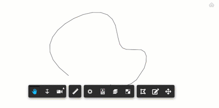

# Edit2D

[Demo](https://aps-extensions.autodesk.io/?extension=Edit2dExtension)

Shows some Edit2D extension functionality.



## Usage

Enable the extension, click on the model element, use the `gizmo` to move the element.

## Setup

Include the CSS & JS file on your page. This CDN is compatible with the lastest Viewer version (v7).

```xml
<script src="http://cdn.jsdelivr.net/gh/autodesk-forge/forge-extensions/public/extensions/Edit2dExtension/contents/main.js"></script>
```

After Viewer is ready, preferably inside `onDocumentLoadSuccess`, load the extension

```javascript
viewer.loadExtension("Edit2dExtension")
```

## How it works

It uses the code introduced in [Edit2D Setup](https://aps.autodesk.com/en/docs/viewer/v7/developers_guide/advanced_options/edit2d-setup/) available in the Viewer online documentation

