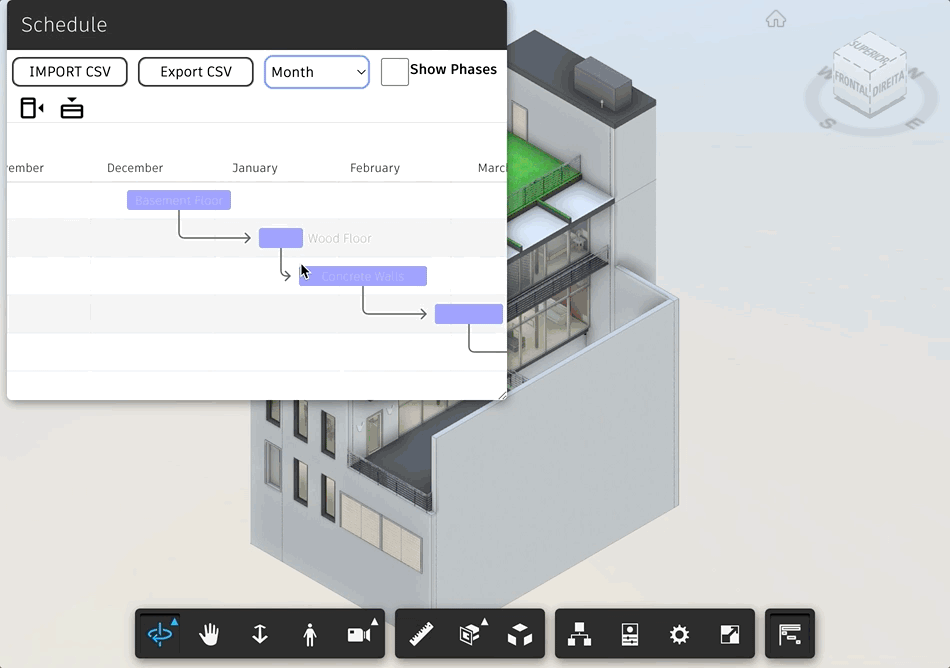

# Phasing Extension

[Demo](https://aps-extensions.autodesk.io/?extension=PhasingExtension)

APS Viewer extension to add Gantt chart connected with the model.

## Usage

- Load the extension in the viewer
- Import one CSV with the configuration
- New docking panel opens showing Gantt chart with the tasks connected to elements of the scene

## Setup

Include the JS file on your page.

Everything is inside `main.js` file (extension and panel).
in panel class there's also the reference for the external libraries used by this extension:

[Sweetalert2](https://sweetalert2.github.io)

[Frappe Gantt](https://frappe.io/gantt)

## How it works

This extension build the tasks based on the csv imported.
The Gantt chart generated is connected with the model in a way that by double clicking in a task, the correlated elements get isolated.
There are also options to control UI and override elements colors based on the status of each task.

To help you quickly take advantage of it, you can find a [sample.csv](./assets/sample.csv) compatible with the Office.rvt model available at [extensions sample](https://aps-extensions.autodesk.io)
