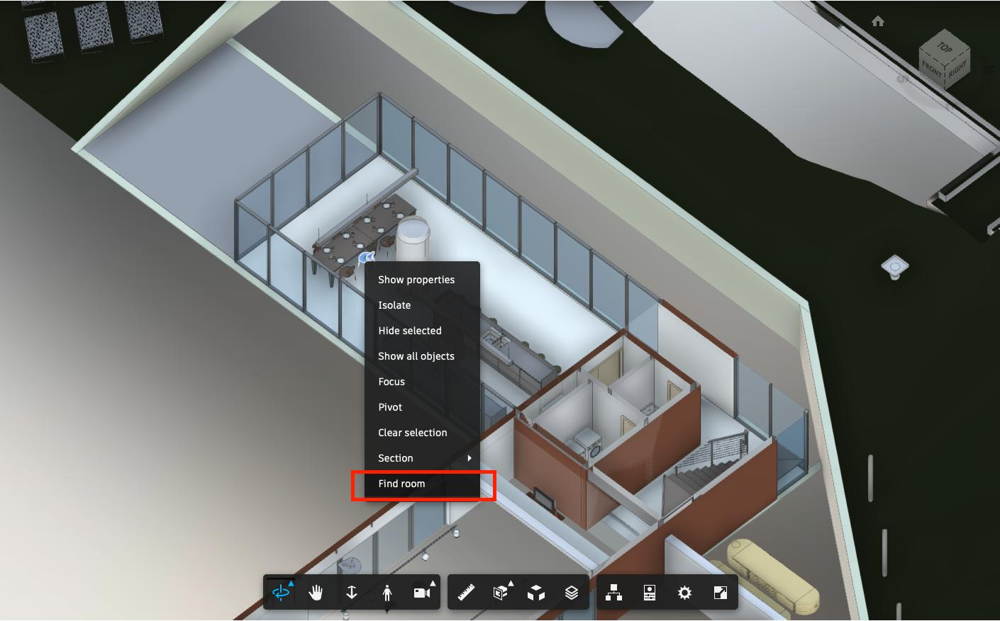
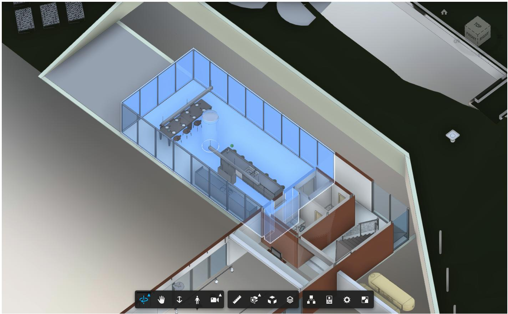

# Room Locator

[Demo](https://aps-extensions.autodesk.io/?extension=RoomLocatorExtension)

A APS Viewer extension for finding the room where the selected object is located





## Limitation

- Revit room only exists in the [master views](https://aps.autodesk.com/en/docs/model-derivative/v2/tutorials/prep-roominfo4viewer/about-this-tutorial/), so before loading this extension, please ensure the current loaded model is a master view.
- This process would reduce the viewer performance since JavaScript is running on a single thread on the Web Browser, so you may use some technologies like the [web worker](https://www.w3schools.com/html/html5_webworkers.asp) to do the complex calculations on a separate thread.

## Usage

Enable the extension, select an object in the viewer, right-click to open the context menu, and then click on the `Find room`.

## Setup

Include the JS file on your page. This CDN is compatible with the latest Viewer version (v7).

```xml
<script src="http://cdn.jsdelivr.net/gh/autodesk-forge/forge-extensions/public/extensions/RoomLocatorExtension/contents/main.js"></script>
```

After Viewer is ready, preferable inside `onDocumentLoadSuccess`, load the extension

```javascript
viewer.loadExtension("RoomLocatorExtension")
```

## Author  
[Eason Kang](https://twitter.com/yiskang)